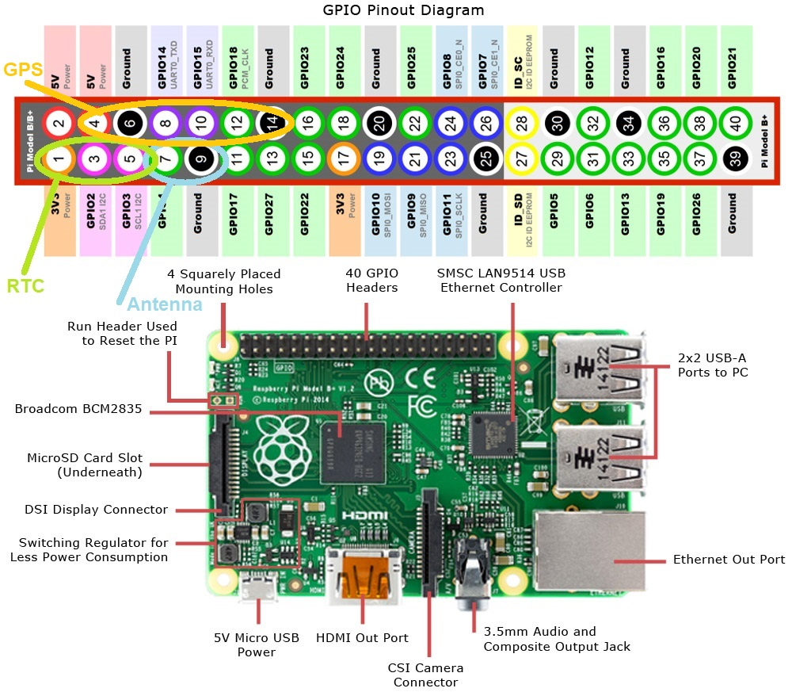
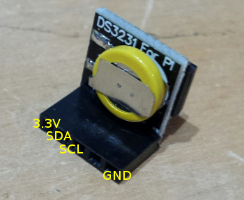
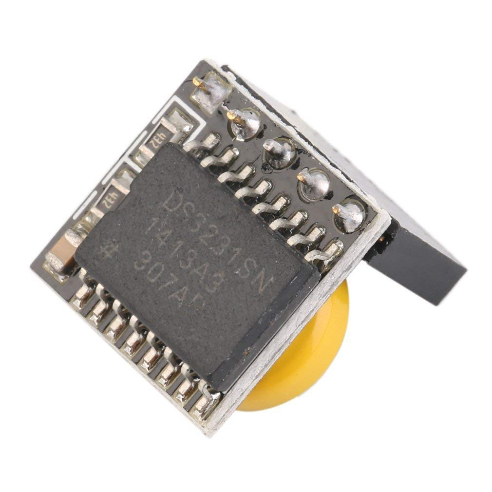
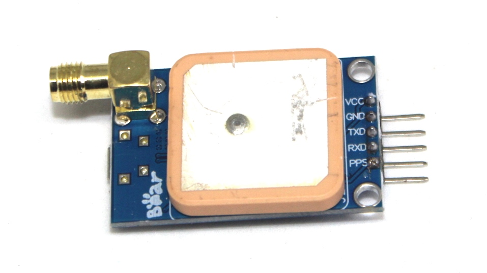

# README

## PiFunk Radio Transmitter - with FM/AM-Modulation for HAM-Bands

**Early Experimental!**

(WIP - Work in Progress)

___

### Configurations

0. Download Linux-Pi-Distro

[Raspbian Buster lastest (Full)](https://downloads.raspberrypi.org/raspbian_full_latest) >= v4.19.97

or use the extra provided imager and extract and load bootable image on SD-card via Rufus

1. Get this program:

`sudo apt-get install git` via git or download it on the page as tar.gz/zip

`git clone https://github.com/wodowiesel/PiFunk`

2. To configure the Pi for modules via menu (I2C, UART etc.): `sudo raspi-config`

Not recommending to use w1-protocol at the beginning (i don't need it in my setup)

Using w1-gpio sometimes needs a 4.7 - 10 kΩ pullup resistor connected on GPIO Pin

1-Wire by default BCM4 setting needs to be activated in boot-config for autostart additionally

(if you have problems deactivate 1-wire config!)

3. Manually open with nano-editor: `sudo nano /boot/config.txt` (i provide one too)

check/add lines:

`dtoverlay=gpiopin=4,pullup=0` add pullup=1 or w1-gpio if needed

`dtoverlay=audio=on` for bcm audio required

optional:

`dtparam=spi=on` for SPI support optional

`dtoverlay=i2c1-bcm2708` for pi 4 2711 for using I2C Bus

`enable_uart=1` for UART RX & TX

`init_uart_baud=9600` data transmission rate for serial data

`dtoverlay=pps-gpio,gpiopin=18` for GPS-device pps (puls-per-second)-support

Add PPS to autostart boot process:

`sudo nano /boot/cmdline.txt`

`bcm2708.pps_gpio_pin=18` It must be on the same line, not on a new line

Sync to GPS 1 PPS signal for Pi PCM-Clock (PIN 12 / GPIO 18 = PCM_CLK / PWM0) or RTC for accuracy

`sudo nano /etc/modules` opens `modules.conf` with text editor (provide one too)

`pps-gpio` Add this line at end of the list

4. Save your changes with ctrl-o <return/enter> then exit with ctrl-x and reboot

`sudo lsmod | grep pps` to check the loaded modules

output be like:

`pps_gpio 2529 1` and `pps_core 7943 2 pps_gpio`

To run the pps command:

`sudo ppstest /dev/pps0` it should fetch the data and print it

___

### Installations

5. First update & upgrade system:

`sudo apt-get update` for system updates

`sudo apt-get upgrade` for system upgrades

6. You will need some libraries for this:

a) `sudo apt-get install libraspberrypi-dev raspberrypi-kernel-headers` for Kernel & Firmware

b) `sudo apt-get install libsndfile1-dev` for ALSA SND-lib

or download it directly [SND](https://packages.debian.org/de/sid/libsndfile1-dev)

c) `sudo apt-get install python-dev python3-dev` for py3

d) [RPi.GPIO lib v0.7.0+ for Py3](https://files.pythonhosted.org/packages/cb/88/d3817eb11fc77a8d9a63abeab8fe303266b1e3b85e2952238f0da43fed4e/RPi.GPIO-0.7.0.tar.gz) (also in repo)

[RPi.GPIO Project Site](https://pypi.org/project/RPi.GPIO/)

[RPi.GPIO Sourceforge-Site](https://sourceforge.net/projects/raspberry-gpio-python/files/)

or download via terminal: `sudo wget https://pypi.python.org/packages/source/R/RPi.GPIO/RPi.GPIO-0.7.0.tar.gz`

then extract: `tar -xvf RPi.GPIO-0.7.0.tar.gz` or a later version

and install it: `sudo pip-3.7 install RPi.GPIO` for Py3 (easiest way)

or alternative way: `sudo apt-get -y install python3-rpi.gpio`

7. Compiler installation:

a) GNU C Compiler GCC `sudo apt-get install gcc-9.2.0` or g++

b) GNU Debugger GDB `sudo apt-get install gdbserver`

8. `sudo reboot` then reboot to apply the changes

___

### Builds

9. Navigate to directory:

a) `cd PiFunk` with default path: `/home/pi/PiFunk/`

b) GCC Compiler flags:
You can use this flags in your makefile or directly in your terminal if you prefer it manually

`-g3` for normal GNU compiler debug informations (1-3 level, 2 is default)

`-ggdb3` for GNU debugger informations level 3

`-Wall` for debug all warning informations

`-Werror` for debug error informations

`-v` Print compilation verbose informations

`-std=c99` (as iso `-std=iso9899:1999` strict)

`-std=gnu99` with additional gnu extension with c99 (what i use)

(`-std=gnu++17` if you like with version 11/14/17 or later)

`-pedantic-errors` for error console messages if problem between c99 and gnu extensions

`-Iinclude ` for using include-directory with header files

`-I/opt/vc/include/` for loading bcm headers folder-path

`-Llib` for using library-directory

`-L/opt/vc/lib` for loading bcm lib folder-path

`-lgnu` for extra gnu-lib

`-lm` for math-lib is obligatory!

`-lbcm_host` for loading bcm firmware >= v1.20190718

`-lpthread` lib for process threads

`-lgthread` lib for graphic threads (not needed right now)

`-lsndfile` -l links library name for ALSA "snd"-lib

`-lpifunk` for using own pifunk lib if needed or self-made beforehand see under b)

`-shared` for generating shared object libraries

`-c` for compiling without linking for making object

`-E` for stopping after preprocessing stage in compilation

`-D_USE_MATH_DEFINES` for mathematical lib definitions

`-D_GNU_C_SOURCE` for loading GNU C Source Macros for non-std setups

(combining lot of different ones: ISO C89, ISO C99, POSIX.1, POSIX.2, BSD, SVID, X/OPEN, LFS)

`-D_POSIX_C_SOURCE=200809L` for POSIX2 Macros needed with bcm (or 199309L for POSIX1)

`-DRASPI=1` defines the macro to be used by the preprocessor (here the Pi model or 0-4, else std-values 0-3)

 -> will be detected by the Makefile via the type of the ARM-Processor

 (other macros possible if in the C-code implemented)

`-fPIC` for generating position independent code (PIC) for bigger programs

`-O3` for optimization stage 1-3 (memory, speed etc.) via compiler

`-o` for individual output-filename flag

10. Generating libraries:

a) Image of the GCC Flow-diagram for generating [Libraries](docs/GCC_Schema.jpg)

*.c=C-code, *.h=headerfile,

*.i=assembled preprocessor C-code, *.S=assembler-code, *.s=preprocessed assembler-code,

*.o=compiled object, *.lib=library object, *.a=archive object, *.so=shared dynamic library object,

*.out=default binary, pifunk(.bin)=executable binary (program)

b) manually compiling/linking libraries:

`sudo gcc -Wall -Werror -std=gnu99 -pedantic-errors -g3 -ggdb3 -Iinclude -I/opt/vc/include -Llib -L/opt/vc/lib/`

`-lbcm_host -lm -lpthread -lgnu -lsndfile -shared -O3 -fPIC pifunk.c -D_USE_MATH_DEFINES -D_GNU_SOURCE -DRASPI=1`

`-o include/pifunk.i lib/pifunk.s lib/pifunk.o lib/pifunk.a lib/pifunk.lib lib/pifunk.so`

c) manually compiling/linking executable binary:

`sudo gcc -Wall -Werror -std=gnu99 -pedantic-errors -g3 -ggdb3 -Iinclude -I/opt/vc/include`

`-Llib -L/opt/vc/lib/ -lbcm_host -lm -lpthread -lgnu -lsndfile -shared -O3 -fPIC pifunk.c`

`-D_USE_MATH_DEFINES -D_GNU_SOURCE -DRASPI=1 -o bin/pifunk`

d) optional Pi-Flags:

 `-march=armv6l` architecture version of ARM ("native" is auto option)

 `-mtune=arm1176jzf-s` special architecture type tuning

 `-mfloat-abi=hard` floating-point ABI to use, permissible values are: ‘soft’, ‘softfp’, ‘hard’

 `-mfpu=vfp` virtual floating point hardware module support pi1-4, for pi2/3/4 use ‘neon-vfpv4’

 `-ffast-math` increase speed for float ops and outside the IEEE-standard and deactivates errno-functions

 `sudo piversion` for checking your pi version

e) Makefile commands:

 `sudo make piversion` for checking your pi version via make

 `sudo make install` for installing pifunk files incl. build folder

 `sudo make uninstall` for uninstalling pifunk files

 `sudo make` for compilation with pre-configured flags for compilation for all Pi's

 `sudo make run` for running with standard pifunk flags

 `sudo make help` for starting help command of pifunk

 `sudo make assistant` for starting step-assistant of pifunk

 `sudo make clean` for removing pifunk.out and pifunk.o files in bin folder if necessary

___

### Preparations

11. Hardware-Setup:

a) Use (original) power supply 10 W, +5 V @ ~2 A or ~ +5 V / 500 mA via mini-USB 2.0 or 5 V Pins possible)

b) Check specifications: my Pi B+ v1.2 @ 700 MHz / 512 MB RAM on ARM processor with driver bcm2835-v1.55

-> SoC from Broadcom	depending on pi model: BCM2709, BCM2711 // BCM2835,	BCM2836,	BCM2837, BCM2837B0

for more infos on other boards just visit [Adafruit](http://www.adafruit.com)

or [Wikipedia Spec Summary](https://de.wikipedia.org/wiki/Raspberry_Pi)

c) Antenna to GPCLK0 (GPIO 4, PIN 7) for PWM (Pulse with Modulation)

@ 2-4 mA (max. 50 mA on ALL PINs and 16 per bank!)

- Antenna should be grounded (see Pinout image) to prevent noise and other problems

- For transmission you should use tested/certified antennas with mounts (BNC/SDA/PL - m/f) if possible

- Tip: You could use just a copper wire for antenna:

 CB 11 m-Band (lambda/2, 5.5 m, 216.535" in) and 70 cm-Band (PMR) (lambda(1/4), 17.0 cm, 6.7" in)

d) You can try to smooth the Resistance R out with a 1:X (1-43)

if using long HF antenna for adapting Resistance

or use a 1:1 balun choke with a ferrite-ringcore or 1:1.5 from 75 Ohm to 50 Ohm

e.g.: FT23-43 with 2x 4 turns for CB (27 MHz)

You can compare the different materials for specific frequencies:

[Datasheet](https://www.funkamateur.de/tl_files/downloads/hefte/2008/FA-BE-Info_Amidon-FT.pdf)

- Dummy-load: 1-100 W @ 50 Ohm "cement" or similar (aluminium case) with cooler for testing

e) For handling overheating of the Pi's processor use cooling-ribs with fan (+5 V DC/0.2 A - 20x20 mm)

you can overclock the Pi if you want to on own risk but it's not recommended

f) RTC: Module DS3231 uses

+3.3 V (PIN 1), SDA0 (PIN 3, GPIO0 on I2C), SCL0 (PIN 5, GPIO 1 on I2C) & GND (PIN 9)

-> need to activate I2C in pi config!

g) GPS Module: Ublox Neo 8M (best one so far)

Pinout: +5 V (PIN 4), GND (PIN 6), RX to UART-TXD (GPIO 14, PIN 8), TX to UART-RXD (GPIO 15, PIN 10), PPS to PCM_CLK (GPIO 18, PIN 12)

it prints in NMEA format so change config `ttyAMA0` to `tty1`

`sudo cat /dev/ttyAMA0` or alternative `sudo cat /dev/ttyS0`

-> need to activate UART (serial 0) in pi config! Yes here crosswiring!! -> (RX of GPS receives what Pi TX'ed)

h) Morse-code-table:

Will be implemented later!

___

### Run

12. Run with admin/root permissions:

Arguments: would be best to input in this specific order to prevent problems

Use '. dot' as decimal-comma separator!

`[-n <filename.wav>]` path & name of soundfile

`[-f <MHz>]` freq

`[-s <kHz>]` samplerate 2250 default

`[-m <fm/am>]` mod, mode for modulation

`[-p <0-7)>]` power 2-16 mA (level 7 default) for transmission

`[-c <callsign>]` your official callsign or individual nickname

additional/optional flags:

`[-g <7 (default) or 21>]` gpiopin, alternatives: 20,29,32,34,38 (not recommended)

`[-d <0/7/14(default)/255>]` dmachannel, 255 means off

`[-b <6.25 (default)/10.00/12.50/20.00/25.00>]` bandwidth of the signal

`[-t <1=(a)nalog, 2=(d)igital>]` type of modulation

`[-x <on/off>]` gps support

extra single menu-flags: -> no further argument needed

`[-a]` for assistant in step-by-step

`[-h]` for help with more infos and arguments

`[-u]` for extra menu (csv, commandline)

default: `sudo ./pifunk -n sound.wav -f 446.006250 -s 22050 -m fm -p 7 -c callsign` -g 7 -d 14 -b 12.50 -t 1 -x off

Radio works with .wav-file with 16-bit @ 22050.000 [Hz] mono / 0.1-700 to 1500 MHz range depending on the Pi.

It's recommended not to transmit on frequencies higher than the processor speed at the moment to prevent stuttering/lags,

but results would be interesting to know with overclocking.

Explicit CTSS-Tones (38 included) for PMR can be found here as a list: [CTSS](ctsspmr.csv)

___

### Disclaimers

13. Warnings/Caution:

- Private Project! It's Early Access & Work in Progress (WIP)!

- I'm not a professional so **NO guarantees or warranty** for any damage etc.!!

- Usage at **your own risk** !!

- Check laws of your country first! Some Frequencies (MHz) & Powerlevels (W / Watt) are prohibited or need at least a HAM-License!

- Pi operates with square-waves (²/^2)!! Use Low-/High-Band-Pass-Filters with dry (not electrolytic) capacitors

  (C=10-100 pF (Farad)) with solenoid (ring) toroid (ferrite) chokes (B=10-50 uH (Henry) like the FT37-43)

  or resistors (R=~10 kOhm), diodes to prevent backflow

  transmission (TX) simultaneously on permitted frequencies! -> [Bandpass-Diagram](docs/filter_600.jpg)

* Help / Testers and Feedback are always appreciated! :)

* Thank you and have fun 73!

___

### Links

14. Additional Guidelines

[GitPage](https://wodowiesel.github.io/PiFunk/)

[Wiki](https://github.com/wodowiesel/PiFunk/wiki)

[Readme Guideline](README.md)

[Contribution Guideline](docs/CONTRIBUTING.md)

[Code of Conduct Guideline](docs/CODE_OF_CONDUCT.md)

[Copying Guideline](docs/COPYING.md)

[License Guideline](LICENSE.md) under Open-Source GPL v3.0

Would appreciate being named in the source, Thank you.

### Acknowledgements

 15. Credits

based on pifm/am, pifmadv, pifmrds scripts/snippets
